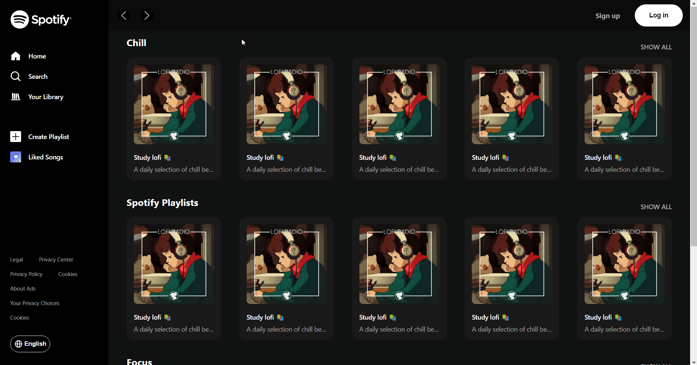

# Spotify-Recreation
A webpage that imitates the non-logged in Spotify homepage. I built this project to work on my css skills and learn flex-box. Through this project I also learned about svg's and how to manipulate them in css effectively.

# Demo

